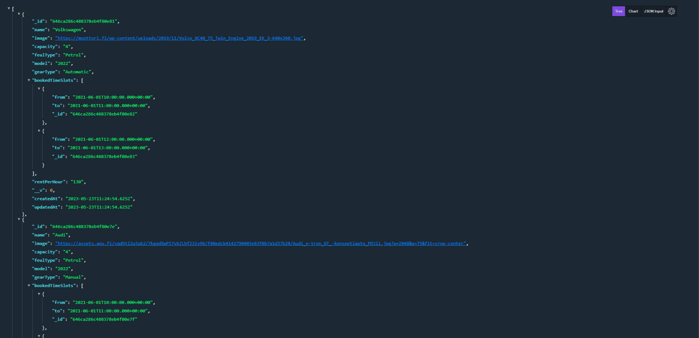

## Car Rental MERN-STACK



## Installation

1- Clone the repo

```bash
https://github.com/capo33/rental-car-backend
```

2- Install dependencies

```bash
yarn
```

3- Create .env file

4- Add your own data in .env file

```bash
## Port to listen on
PORT= your_port

# MongoDB connection string
MONGODB_URI= your_database

#JWT secret
JWT_SECRET= your_secret

# STRIPE secret key
STRIPE_SECRET_KEY= your_secret_key
```

## Usage

1- Go to the root directory and start the server

```
yarn run dev
```

## Tech

- [node.js]
- [Express]
- [mongodb]
- [Typescript]

  [node.js]: http://nodejs.org
  [express]: http://expressjs.com
  [mongodb]: https://www.mongodb.com//
  [Typescript]: https://www.typescriptlang.org/